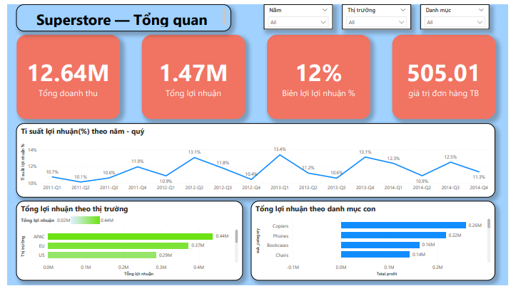
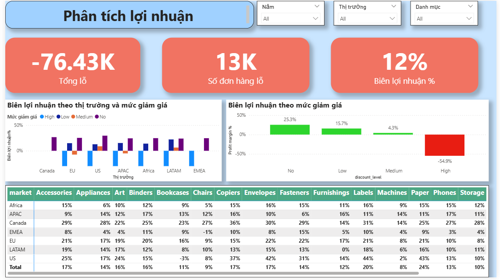
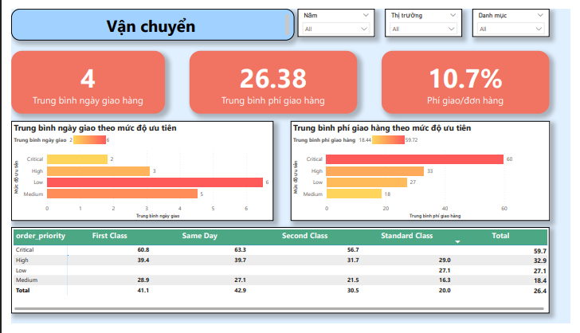
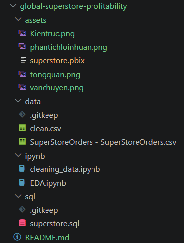

# Global Superstore — Dự án phân tích lợi nhuận

SQL · Python · Power BI

---

## Bối cảnh

Global Superstore là dữ liệu bán hàng của một chuỗi bán lẻ hoạt động ở 7 thị trường, từ 2011 đến 2014. Nhìn tổng thể công ty đang có lãi, nhưng con số tổng thường che giấu vấn đề bên dưới. Project này đóng vai một data analyst được giao nhiệm vụ: tìm ra lợi nhuận đang bị ảnh hưởng ở đâu, vì sao, và có gì để đề xuất.

**Dataset**
- Nguồn: [Global Superstore Dataset (Kaggle)](https://www.kaggle.com/datasets/thuandao/superstore-sales-analytics)
- Quy mô: 51,290 dòng đơn hàng, 21 cột gốc, trải trên 7 market và 4 năm
- Mô tả: dữ liệu bán hàng chi tiết theo từng dòng sản phẩm trong đơn là sales, profit, discount, shipping  cho một chuỗi bán lẻ hoạt động toàn cầu

## Câu hỏi Business 

1. Sản phẩm nào, ở thị trường nào đang gây lỗ?
2. Discount có phải nguyên nhân gây lỗ không?
3. Chi phí vận chuyển có đang hợp lý theo mức độ ưu tiên đơn hàng không?

## Những phát hiện

- Ở mức market-category không nhóm nào lỗ  nhưng  ở mức **market-(sub-category)**, Tables đang lỗ ở hầu hết các thị trường. Chỉ hiện ra khi nhìn đúng độ chi tiết nếu nhìn ở mức quá tổng quát sẽ bỏ lỡ hoàn toàn.
- Discount cao đi kèm lỗ nhiều khi nhìn tổng thể, nhưng đó có thể chỉ vì discount cao rơi đúng vào sản phẩm/thị trường vốn đã khó khăn.So sánh  **trong cùng một sub-category, cùng một market, chỉ khác mức discount** ta thấy cùng là Tables ở cùng một market, không giảm giá thì lãi, giảm giá cao thì lỗ nặng. Discount là nguyên nhân, không phải do bản thân sản phẩm khó bán.
- Đơn có độ ưu tiên Critical  được giao nhanh hơn hẳn (~2 ngày so với ~6 ngày của đơn Low)  đúng như kỳ vọng hệ thống ưu tiên vận hành. Nhưng đổi lại, chi phí vận chuyển cao hơn khoảng 3.2 lần so với đơn Medium.

## Dashboard

## Kiến trúc

## Cấu trúc thư mục

